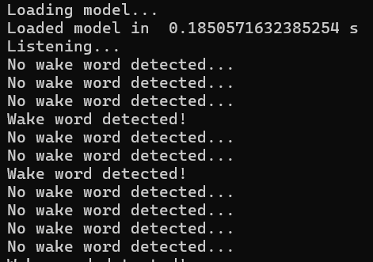

# Wake Word Detector - Arise

This is a wake word detector that recognizes when a speaker says the word "Arise" in English. 

## File Organization

Here is the general organization of this repo. 

```bash
Wake_Word_Detector/
├── README.md
├── LICENSE
├── package.json
├── Data/
│   ├── test/
        ├── neg/
        ├── pos/
    ├── train/
        ├── neg/
        ├── pos/
├── model/
│   ├── ARISE.pth
├── record.py
├── process.py
├── train.py
├── interval_listen.py
├── continuous_listen.py
```
The `Data` folder contains all the training and test data for the PyTorch model. 

`train.py` trains and tests the PyTorch model using the data (stored in csv files) generated by `process.py`. 

## Usage 

### Dependencies

To fully utilize this codebase, you will need to download all the dependencies specified in the `requirements.txt` file. 

### Running Existing Model 

You can try out the existing model by running the following command.

```
python continuous_listen.py
```

This will start an infinite loop (which can be terminated with CTRL+C) where the model tells you if it ever hears "Arise." It might look something like this. 


<!--  -->


### Recording New Data
If you would like to record your own data to add to the dataset, you can do so by running the following command. 

```
python record.py [auto/manual] [saved-dir] [start-point]
```

You can select between `auto` or `manual` mode. In auto mode, the computer will continuously record a set number of 2 second sample audio clips. In manual mode, you will be asked to press Enter to initiate the recording of each 2 second sample. 

Then, you can specify where to save these recordings in `[saved-dir]`. Finally, `start-point` tells the computer how to start numbering the names of these audio files. For example, if it's 5, then your recordings will be saved as `5.wav`, `6.wav`, `7.wav` and so on. 

### Data Processing 


